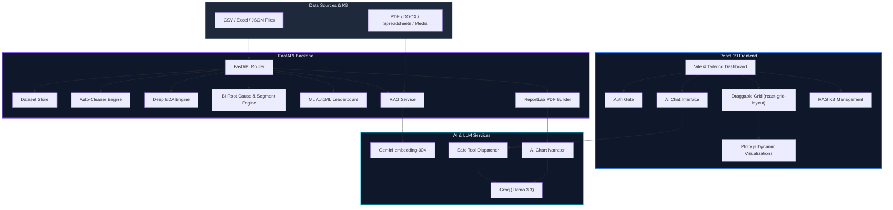

<p align="center">
  
</p>

<p align="center">
  
  
  
  
  
  
</p>

<br />

---

### 🔬 **Analytiq** is a premium, enterprise-grade AI-powered data analytics and business intelligence platform.

Rebuilt from the ground up as a production-ready application, it pairs a fast **FastAPI Python backend** with a highly interactive **React 19 + TypeScript frontend**. It features a draggable Power BI-style dashboard, multimodal RAG studio, auto-ML pipelines, statistical EDA, and auto-generated senior-analyst PDF reports.

<p align="center">
  
</p>

---

## 🗺️ Architectural Flow

Here is the high-level architecture and system flow of the Analytiq ecosystem:



---

## ✨ Enterprise Features

| Category | Feature | Description |
|---|---|---|
| 📥 **Smart Ingestion** | **Robust Upload** | Handles CSV, Multi-Sheet Excel, and JSON files up to 200 MB with strict dirty-data tolerance. |
| 🧹 **Data Sanitization** | **Data Quality Hub** | Instant per-column quality profiling, outlier detection, and one-click auto-cleaning with undo features. |
| 📊 **BI & Analytics** | **Power BI Dashboard** | Draggable, resizable layout tiles, dynamic KPI strip, custom tile builder, and automatic cross-filtering. |
| 🔬 **Statistical Suite** | **Deep EDA** | Normality testing, distribution fitting, time-series stationarity checks, ANOVA, and VIF calculations. |
| 💡 **Strategic Insights** | **Business Intel** | Domain-aware insight cards across eight domains (HR, Sales, Finance, E-commerce, Marketing, SaaS, Operations, Healthcare), Root Cause analysis, cohort tracking, and Pareto charts. See [docs/ADDING_A_DOMAIN.md](docs/ADDING_A_DOMAIN.md). |
| 🤖 **Automated ML** | **Predictive modeling** | Auto task detection (Classification/Regression), CV leaderboard scoring, and feature importance mappings. |
| 💬 **AI Copilot** | **Safe Chat Agent** | Plain-English query processor -> secure tool dispatcher (no code execution) -> interactive charts and tables. |
| 🧠 **Knowledge Store** | **RAG Studio** | Custom local vector index ingestion of PDFs, DOCX, CSVs, and video/images via Gemini Vision embeddings. |
| 📄 **Executive Reports** | **Document Generator** | Beautifully styled ReportLab PDF reports (cover page, TOC, benchmarks, and AI-narrated chart guides). |

---

## 🛠️ The Tech Stack

```
Backend ──── FastAPI · pandas · scikit-learn · scipy · statsmodels · ReportLab
Frontend ─── React 19 · TypeScript · Tailwind CSS 4 · Plotly.js · Zustand
AI ───────── Groq (Llama 3.3) · Google Gemini (Vision, Embeddings)
RAG ──────── Custom NumPy Vector Store · Gemini text-embedding-004
Deployment ─ Docker · Render / Railway
```

---

## 🚀 Local Development

### 1. Backend Setup (Python 3.11+)
```bash
# Navigate to the backend directory
cd backend

# Install dependencies
pip install -r requirements.txt

# Create environment configuration
cp .env.example .env          # Update with your actual API keys

# Start the server (runs on http://localhost:8000)
uvicorn app.main:app --reload --port 8000
```

### 2. Frontend Setup (Node.js 20+)
```bash
# Navigate to the frontend directory
cd frontend

# Install node dependencies
npm install

# Start local development server (proxies /api to port 8000)
npm run dev
```

### 3. Running Automated Tests
Run the 37-point end-to-end integration and smoke test suite:
```bash
cd backend
python tests/smoke_test.py
```

---

## 🔑 Configuration & Keys

The application remains fully functional locally without keys (AI modules degrade gracefully and show setup alerts). Add these to your `.env` to activate intelligence features:

| Environment Variable | Source | Functionality |
|---|---|---|
| `GROQ_API_KEY` | [console.groq.com](https://console.groq.com) | Free tier. Powers the AI Chat copilot and chart narratives |
| `GEMINI_API_KEY` | [aistudio.google.com](https://aistudio.google.com) | Powers image/video analysis, RAG indexing, and executive summaries |
| `OPENROUTER_API_KEY` | [openrouter.ai](https://openrouter.ai) | Optional. The `:free` model slugs cost nothing — Llama 3.3, DeepSeek, Qwen |
| `CEREBRAS_API_KEY` | [cloud.cerebras.ai](https://cloud.cerebras.ai) | Optional. Free tier, openly-licensed weights, very fast |
| `TOGETHER_API_KEY` | [api.together.xyz](https://api.together.xyz) | Optional. Small free credit, openly-licensed weights |
| `LOCAL_LLM_URL` | your own machine | Optional. Any OpenAI-compatible server (Ollama, llama.cpp, vLLM, LM Studio). No key, no cost, no data leaving the box |
| `LLM_ROUTING` | you choose | Which **model** does which job, e.g. `chart_caption=groq/llama-3.1-8b-instant,rag_report=openrouter/deepseek/deepseek-r1:free`. A bare provider name still works and means that provider's default model |
| `LLM_PROVIDER_ORDER` | you choose | The fallback chain. Default `groq,openrouter,cerebras,together,gemini,local`. A provider with no key is skipped, not an error |
| `LLM_PRIVACY_MODE` | you choose | `1` refuses every cloud call outright. Only a local model may be used. Reports still build — the engines write their own findings |
| `APP_ADMIN_KEY` | you choose | Master key for account management (`/api/admin/*`). Unset + zero accounts created = open/no-auth (local dev only). `APP_PASSWORD` also works as a fallback name. |
| `DATA_TTL_DAYS` | you choose | Days before an uploaded dataset or RAG knowledge base is auto-deleted. Default `30`. Set `0` to disable expiry entirely. |
| `CLEANUP_INTERVAL_HOURS` | you choose | How often the expiry sweep runs in the background. Default `6`. A sweep also runs once at startup, and can be triggered manually via `POST /api/admin/cleanup`. |
| `APP_SECRET` | you choose | Signs client login tokens. Optional — auto-generated and persisted to `DATA_DIR/.secret_key` if unset. Set explicitly if you run multiple backend instances behind a load balancer, so they all validate the same tokens. |
| `TOKEN_TTL_DAYS` | you choose | How long a client's login session lasts before they must sign in again. Default `30`. |

### 🎬 Video-to-dataset extraction

Uploading a video of a table/spreadsheet/dashboard (`POST /api/datasets/extract-from-video`) extracts a handful of visually-distinct frames locally with **ffmpeg** — free, no API cost — then runs each frame through the same image-table-extraction path as a photo upload, merging the results. This is why the Docker image installs `ffmpeg`; if you deploy without Docker (a bare `pip install` on your own host), install `ffmpeg` yourself or this one endpoint will return a clear "ffmpeg is not installed" error while everything else keeps working.


### 👥 Multi-tenant clients

Each client gets their own account and only ever sees their own datasets and RAG knowledge bases — enforced both by an ownership check on every request and by physically separate storage directories per client. Onboard a client:

```bash
curl -X POST https://your-deployment/api/admin/users \
  -H "Authorization: Bearer $APP_ADMIN_KEY" \
  -H "Content-Type: application/json" \
  -d '{"username": "acme_corp", "password": "a-strong-password"}'
```

They then log in at `/api/auth/login` with that username/password (the app's login screen does this for them) and get a token scoped to only their own data. To offboard a client — this **permanently deletes every dataset and knowledge base they own**, not just their login:

```bash
curl -X DELETE https://your-deployment/api/admin/users/acme_corp \
  -H "Authorization: Bearer $APP_ADMIN_KEY"
```

List current clients with `GET /api/admin/users` (same admin header).

### ✅ Verifying your keys actually work

A key can be present, well-formed, and still not work — expired, from
the wrong account, out of quota, or blocked by the network the app is
deployed on. None of that is visible from the configuration, and all of
it looks identical from the outside: the reports quietly come back in
the engines' own wording instead of the model's.

The only machine that can answer "does my key work" is the one holding
the key. Secrets set in Render's dashboard, or in GitHub Actions, are
not visible anywhere else — a GitHub secret in particular is *not*
readable by the running service unless a workflow passes it through.

So the check lives in the running app. Open the **System** page, or:

```bash
curl -X POST https://your-deployment/api/admin/llm-check \
  -H "Authorization: Bearer $APP_ADMIN_KEY"
```

It makes one real call to every configured provider and reports, per
provider: whether the key is present, whether the host answered, whether
the model produced words, how long it took — and if not, the provider's
own error message plus what to do about it. `GET /api/admin/llm-status`
is the same picture without making any calls.

Locally, `python3 backend/scripts/check_api_keys.py` does the same from
a terminal.

### 🎯 A model per job, chosen by what it is good at

Routing is per **task** and per **model**, not per provider — a provider
serves many models, and "use Groq" cannot express "the cheap fast one
for the twenty chart captions in a report, the reasoning one for the
executive summary".

Each task declares the capabilities it needs, each model declares what
it has, and **only a model that has them can be assigned — as a fallback
too**. That last part is the one that matters: gating only the first
choice prevents nothing, because the fallback is exactly where the wrong
model gets in. A photograph of a table can never reach a text-only
model; a root-cause question can never quietly land on a small chat
model that answers confidently and worse.

| Task | Needs | Default |
|---|---|---|
| Chart captions | text | `groq/llama-3.1-8b-instant` — ~20 calls per report, so cheap and fast wins |
| Chat commands | json | `groq/llama-3.3-70b-versatile` — the reply is parsed, not read |
| Executive summary polish | reasoning | *off* — the engine's own wording ships unless you opt in |
| Knowledge base answers / report | reasoning | prefers a **local** model where one is configured |
| Tables from photos and video | vision + json | `gemini/gemini-3.6-flash`, or any local multimodal model |
| Video in the knowledge base | video | `gemini/gemini-3.6-flash` |
| Knowledge base embeddings | embedding | `gemini/gemini-embedding-001`, local MiniLM below it |
| Report cover artwork | image generation | *off* — see below |

Set it on the **System** page (takes effect immediately, no redeploy) or
with `LLM_ROUTING`. The catalogue does not need to know a model for you
to use it: name any `provider/model` and tick what it can do. An unknown
model is assumed to write text and nothing else, so it can never be
picked for vision or embeddings by accident.

Two consequences worth stating: **vision is no longer Gemini-only**, so a
machine running Ollama with Gemma 3 and no API keys at all can take a
photograph of a table and turn it into a report; and the knowledge base
now prefers a model on your own hardware by declaration rather than by
luck of the fallback order.

### 🖼️ Generated imagery — deliberately almost nowhere

Every figure in a report here traces to a source digest. A generated
image traces to nothing, so in a deliverable aiming at Big-4 standard it
is a liability wherever it could be mistaken for information.

So: **off by default**, and when on it may appear on the report cover and
the deck title slide and nowhere else. Never a chart, a table, a KPI
tile or any diagram that asserts a relationship — those stay
deterministic matplotlib and Plotly. The prompt is built from the report
title alone and never touches a column name, a value or a finding, so
the image cannot depict the data even by accident. Every generated image
carries a caption saying it is decorative and contains no data — not
configurable, because that caption is the whole defence of the feature —
and is recorded in the hash-chained audit trail alongside the numbers.

Free and open-source path: point `LOCAL_LLM_URL` at any OpenAI-compatible
`/v1/images/generations` server (AUTOMATIC1111, LocalAI, SD.Next,
ComfyUI) and assign `local/sdxl`.

### 🔒 Data integrity

Governance says what the data is; integrity says whether it can be
trusted. Every upload is hashed as it arrives, every change to it is
appended to a hash-chained audit trail, and the verdict is recomputed
from the stored data on every request rather than read back from a
stored claim.

`GET /api/datasets/{id}/integrity` — and the Governance page, and the
report's Data Governance section — carry the SHA-256 of the file as it
was received. Run `sha256sum` on your original file: if it matches,
every figure in that report came from that file and no other. The report
also records the library versions it was computed with, because a
quantile or a solver default can change between releases.

### 🗄️ Reading from a database instead of a CSV

`POST /api/datasets/warehouse/import` pulls a dataset straight out of
PostgreSQL, MySQL, Snowflake, BigQuery, SQL Server or SQLite, and it
lands in the same store with the same integrity record — except the
audit trail records the *query* it came from rather than a file someone
emailed.

Only `SELECT` and `WITH` are accepted, checked before the statement is
sent, and the connection is rolled back regardless. The connection URL
is supplied per request, never stored, and its password is stripped from
everything the server writes down. SQLAlchemy is included; each
database's own driver (`psycopg[binary]`, `pymysql`,
`snowflake-sqlalchemy`, `sqlalchemy-bigquery`, `pyodbc`) is optional —
`GET /api/datasets/warehouse/backends` reports which are installed and
names the package for the rest.


---

## ☁️ Deployment Guides

### **Render Deployment**
1. Push this code repository to GitHub.
2. Link your repository in Render and create a **Web Service** using the Blueprint configuration in `render.yaml`.
3. Set your environment keys (`GROQ_API_KEY`, `GEMINI_API_KEY`) in the Render Dashboard.

### **Railway Deployment**
1. Initialize a new project on Railway from your repository.
2. Railway will automatically detect the root `Dockerfile` and build a multi-stage production container.
3. Configure variables and deploy.

### **Manual Docker Execution**
```bash
# Build the container
docker build -t analytiq-platform .

# Run the container
docker run -p 8000:8000 \
  -e GROQ_API_KEY=your_key \
  -e GEMINI_API_KEY=your_key \
  -v analytiq-data:/srv/data \
  analytiq-platform
```

---

## 📝 License

This software is subject to a proprietary license. 
Copyright © 2026 Shweta Mishra. All rights reserved. Unauthorized distribution, copying, or modification is prohibited.
