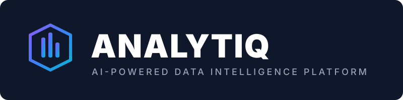
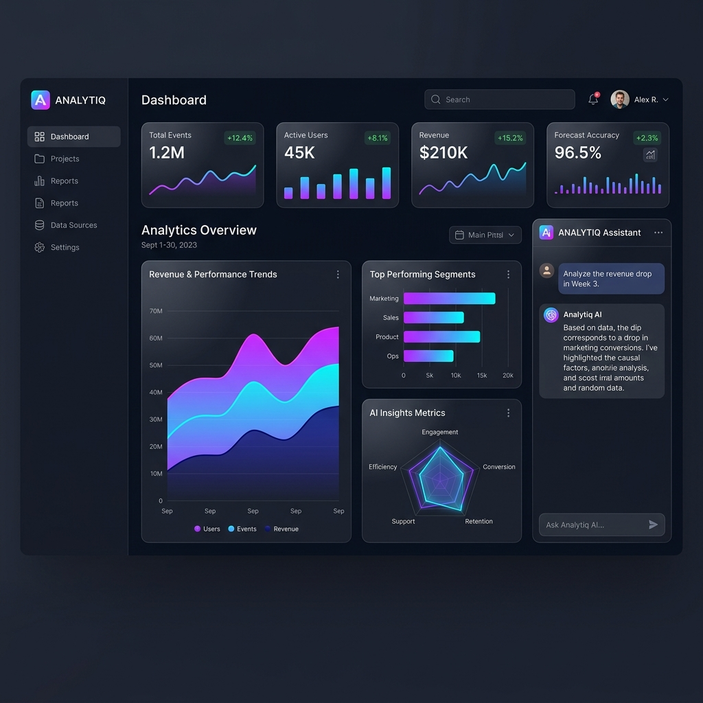
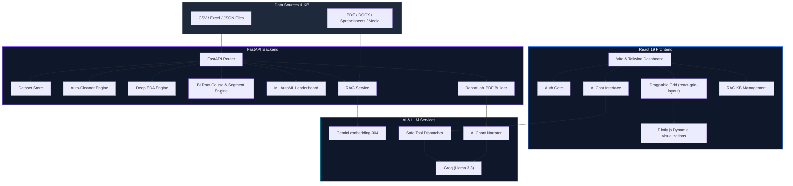

<p align="center">
  
</p>

<p align="center">
  
  
  
  
  
  
</p>

<br />

---

### 🔬 **Analytiq** is a premium, enterprise-grade AI-powered data analytics and business intelligence platform.

Rebuilt from the ground up as a production-ready application, it pairs a fast **FastAPI Python backend** with a highly interactive **React 19 + TypeScript frontend**. It features a draggable Power BI-style dashboard, multimodal RAG studio, auto-ML pipelines, statistical EDA, and auto-generated senior-analyst PDF reports.

<p align="center">
  
</p>

---

## 🗺️ Architectural Flow

Here is the high-level architecture and system flow of the Analytiq ecosystem:



---

## ✨ Enterprise Features

| Category | Feature | Description |
|---|---|---|
| 📥 **Smart Ingestion** | **Robust Upload** | Handles CSV, Multi-Sheet Excel, and JSON files up to 200 MB with strict dirty-data tolerance. |
| 🧹 **Data Sanitization** | **Data Quality Hub** | Instant per-column quality profiling, outlier detection, and one-click auto-cleaning with undo features. |
| 📊 **BI & Analytics** | **Power BI Dashboard** | Draggable, resizable layout tiles, dynamic KPI strip, custom tile builder, and automatic cross-filtering. |
| 🔬 **Statistical Suite** | **Deep EDA** | Normality testing, distribution fitting, time-series stationarity checks, ANOVA, and VIF calculations. |
| 💡 **Strategic Insights** | **Business Intel** | Domain-aware insight cards (HR/Sales/E-commerce), Root Cause analysis, cohort tracking, and Pareto charts. |
| 🤖 **Automated ML** | **Predictive modeling** | Auto task detection (Classification/Regression), CV leaderboard scoring, and feature importance mappings. |
| 💬 **AI Copilot** | **Safe Chat Agent** | Plain-English query processor -> secure tool dispatcher (no code execution) -> interactive charts and tables. |
| 🧠 **Knowledge Store** | **RAG Studio** | Custom local vector index ingestion of PDFs, DOCX, CSVs, and video/images via Gemini Vision embeddings. |
| 📄 **Executive Reports** | **Document Generator** | Beautifully styled ReportLab PDF reports (cover page, TOC, benchmarks, and AI-narrated chart guides). |

---

## 🛠️ The Tech Stack

```
Backend ──── FastAPI · pandas · scikit-learn · scipy · statsmodels · ReportLab
Frontend ─── React 19 · TypeScript · Tailwind CSS 4 · Plotly.js · Zustand
AI ───────── Groq (Llama 3.3) · Google Gemini (Vision, Embeddings)
RAG ──────── Custom NumPy Vector Store · Gemini text-embedding-004
Deployment ─ Docker · Render / Railway
```

---

## 🚀 Local Development

### 1. Backend Setup (Python 3.11+)
```bash
# Navigate to the backend directory
cd backend

# Install dependencies
pip install -r requirements.txt

# Create environment configuration
cp .env.example .env          # Update with your actual API keys

# Start the server (runs on http://localhost:8000)
uvicorn app.main:app --reload --port 8000
```

### 2. Frontend Setup (Node.js 20+)
```bash
# Navigate to the frontend directory
cd frontend

# Install node dependencies
npm install

# Start local development server (proxies /api to port 8000)
npm run dev
```

### 3. Running Automated Tests
Run the 37-point end-to-end integration and smoke test suite:
```bash
cd backend
python tests/smoke_test.py
```

---

## 🔑 Configuration & Keys

The application remains fully functional locally without keys (AI modules degrade gracefully and show setup alerts). Add these to your `.env` to activate intelligence features:

| Environment Variable | Source | Functionality |
|---|---|---|
| `GROQ_API_KEY` | [console.groq.com](https://console.groq.com) | Powering the AI Chat copilot and chart generation narratives |
| `GEMINI_API_KEY` | [aistudio.google.com](https://aistudio.google.com) | Powering image/video analysis, RAG indexing, and executive summaries |

---

## ☁️ Deployment Guides

### **Render Deployment**
1. Push this code repository to GitHub.
2. Link your repository in Render and create a **Web Service** using the Blueprint configuration in `render.yaml`.
3. Set your environment keys (`GROQ_API_KEY`, `GEMINI_API_KEY`) in the Render Dashboard.

### **Railway Deployment**
1. Initialize a new project on Railway from your repository.
2. Railway will automatically detect the root `Dockerfile` and build a multi-stage production container.
3. Configure variables and deploy.

### **Manual Docker Execution**
```bash
# Build the container
docker build -t analytiq-platform .

# Run the container
docker run -p 8000:8000 \
  -e GROQ_API_KEY=your_key \
  -e GEMINI_API_KEY=your_key \
  -v analytiq-data:/srv/data \
  analytiq-platform
```

---

## 📝 License

This software is subject to a proprietary license. 
Copyright © 2026 Shweta Mishra. All rights reserved. Unauthorized distribution, copying, or modification is prohibited.
